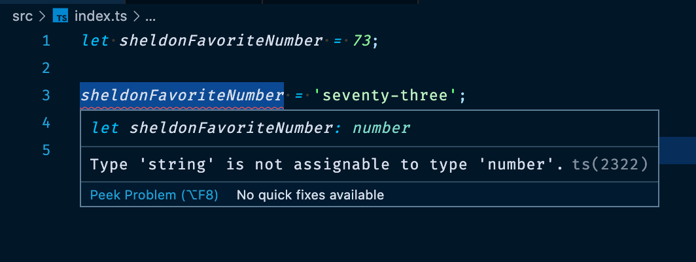
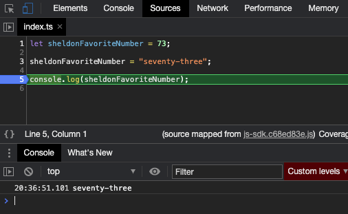
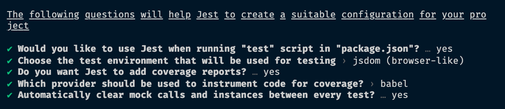
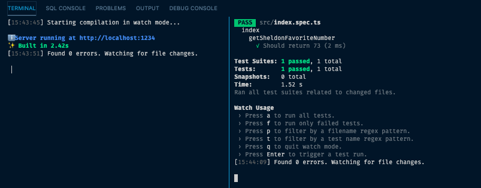

Aha! So here you are to read my story and arguments favoring teaching Typescript instead of Javascript. Unfortunately for you, appreciated reader, this post doesn’t cover the pros and cons around that topic due to there are already plenty of articles on the internet. Instead, this post narrates my journey across how I set up a functional project to demonstrate that is not difficult to start coding Typescript for the Web. Although, before jumping on that track I will tell you why I suggest starting teaching Typescript is the way to go for new Web developers.

Perhaps, the way I made my statement is somehow wrong. I'm going to rephrase what I suggested:

> "Let's teach Javascript on a configured Typescript environment".

The idea behind the suggestion is to leverage Typescript's inferring capabilities on types and let apprentices discover them. Day by day, lesson by lesson, apprentices will learn by themselves that something is supporting them on their long learning Javascript journey, and myself as a coach, I could show them little by little Typescript types and its benefits. From my point of view, this will pay off in the long-term because from the beginning Javascript's bad parts are avoided. Moreover, companies will love to hired junior developers who already know Typescript.

But hey, what about <a href="https://flow.org" rel="noopener" target="_blank">Flow</a>? In 2018 I configured a React project bundled with Webpack to include Flow and the result though it was good, the mere configuration task was tiring. In order to not discuss if Flow could be a good tool to learn, I will ask you to do yourself a favor, google it and search job descriptions where knowing Flow is a plus. I'm sure Typescript demand is already on track and by far is winning the poll.

Now that you are back, you know I always like to start with a User Story, this time my user is an apprentice.

### User Story

As Apprentice<br>
I want to code a Web project in an environment which provides me the following capabilities:

1. I want to be able to develop Web pages using HTML, CSS, and Javascript.
2. I want to be able to debug my code using browser's Web developer tools.

### Prerequisites

1. Might come handy to read what <a href="https://v2.parceljs.org/" rel="noopener" target="_blank">Parcel.js</a> does.

### Let's Do It

Previously, I developed this idea (when it was first presented, <a href="https://github.com/inglkruiz/js-sdk/tree/1.0.0" rel="noopener" target="_blank">v1.0.0</a> using Parcel.js `v1.12.4` because as I mentioned before it was the beginning of the year 2020 and I wanted to deliver a functional project ASAP with stable dependencies (as of the time of this writing Parcel.js v2 is still in beta version). Now, nothing is pushing me to deliver fast and I had the idea of using the version `v2.0.0-beta.1`, what could go wrong? I like to experiment and enjoy the journey.

First, let's create a folder for the project and inside of it set up a new NPM package:

_Using the console/terminal:_

```bash
mkdir js-sdk && cd ./js-sdk && npm init -y
```

As a result you will end up inside the folder with a single file, the `package.json`:

```json {numberLines:true}
{
  "name": "js-sdk",
  "version": "1.0.0",
  "description": "",
  "main": "index.js",
  "scripts": {
    "test": "echo \"Error: no test specified\" && exit 1"
  },
  "keywords": [],
  "author": "",
  "license": "ISC"
}
```

Now, let's install `parcel` as a development dependency:

_Using the console/terminal:_

```bash
npm install -D parcel@next
```

And add two npm scripts (`start` and `build`) to the `package.json`:

```json {numberLines:6}
{
  "scripts": {
    "start": "parcel serve ./src/index.html",
    "build": "parcel build ./src/index.html",
    "test": "echo \"Error: no test specified\" && exit 1"
  }
}
```

Next step is to create the folder (`src`) where apprentices will work and inside of it three files: `index.html`, `index.ts` and `styles.css`:

#### `index.html`

```html {numberLines:true}
<!DOCTYPE html>
<html>
  <head>
    <title>JS SDK</title>
    <meta charset="utf-8" />
    <link rel="stylesheet" type="text/css" href="styles.css" />
  </head>
  <body>
    <h1>Hello world!</h1>
    <script src="index.ts"></script>
  </body>
</html>
```

#### `index.ts`

```typescript {numberLines:true}
console.log("Hello world!")
```

With this setup Parcel works like a charm, apprentices can run `npm start` and open the URL <a href="http://localhost:1234/" rel="noopener" target="_blank">http://localhost:1234</a> (this is where Parcel serves JS, HTML, CSS files and any other assets of the project).

_Note that I didn't describe the `css` file content because it's worthless for the purpose of this post._

For our surprise, we have completed the User story. Let's review the two items mentioned previously:

- I want to be able to develop Web pages using HTML, CSS, and Javascript.

In addition, apprentices can start coding examples or exercises and Typescript's inference system will help them to avoid errors like assigning a different type value to a `number` variable.<br>
<em>These capabilities are provided not by Parcel but by <a href="https://code.visualstudio.com" rel="noopener" target="_blank">Visual Studio Code</a>, the IDE I recommend for Web development.</em>



However, if apprentices save the previous code ignoring Typescript's errors Parcel will compile the code to Javascript with no errors because, although Typescript works out of the box with Parcel it merely strips out the type annotations.

> Perhaps we can improve this later but for now let's leave him learn from his own errors on runtime.

- I want to be able to debug my code using browser's Web developer tools.

If apprentices open browser's Web developer tools (in Google Chrome `Cmd + Opt + I`) and navigate to sources tab, they will be able to debug code as it was written.



### Bonus

In software development one of the most important things is **feedback**. When I'm coaching and give exercises to my apprentices I like they have unit tests running whilst they learn to code, I think that unit tests gives them a better feeling of achievement.

Now, I'm switching to a new User perspective, mine perspective, the coach's perspective. And again a User Story comes to my mind:

### User Story

As Coach<br>
I want to be able to cover examples and exercises code with unit tests. Apprentices should be able to execute a command to run tests while developing.

### Let's Do It (part 2)

Before starting, I have to admit that I thought achieving this would be straightforward but I hit a couple of walls.

I started by choosing <a href="https://jestjs.io/en/" rel="noopener" target="_blank">Jest Testing Framework</a>, so I installed it and its Typescript types:

```bash
npm install -D jest @types/jest
```

And generated an initial Jest configuration file using `jest-cli`:

```bash
npx jest --init
```

This commands will ask few questions where you have to answer Y/N or choose a provided option. Here is a capture of my answers:



It generates a `jest.config.js` file with a short description for each option. Note I chose to use Jest when running "test" script AKA `npm test` but I modified it to run and watch for changes:

#### `package.json`

```json {numberLines:10}
{
  "scripts": {
    "start": "parcel serve ./src/index.html",
    "build": "parcel build ./src/index.html",
    "test": "jest --watch"
  }
}
```

Now, here is where I started to scratch my head because, although I had done this before using Parcel v1 I think I didn't test it properly (I remember it took me 2 hours to build and document it).

The thing is that Jest doesn't compile Typescript to Javascript, it is merely a test runner. Therefore, we need to preprocess Typescript files before running them on Jest. For this, we have 3 possible configurations:

1. Use <a href="https://github.com/azz/jest-runner-tsc" rel="noopener" target="_blank">jest-runner-tsc</a>.
2. Use <a href="https://kulshekhar.github.io/ts-jest/" rel="noopener" target="_blank">ts-jest</a>.
3. Use <a href="https://babeljs.io/" rel="noopener" target="_blank">Babel</a>.

So, I started to evaluate my options.

#### jest-runner-tsc

I noticed that the project had 15 commits (as of the time of this writing) and the latest was on October the 16th, 2019. It was better to discard it.

#### ts-jest

I started to configure it in the project due to the tool claims to beat the limitations I would get if I use Babel. Here an extract from its documentation:

_"While @babel/preset-typescript is a great preset, you must know the limitation of it. Here is what is possible with TypeScript (and ts-jest), which is not with Babel7 and @babel/preset-typescript:<br><br>No type-checking: This is the big PRO of using TypeScript vs Babel, you have type-checking out of the box."_

Nevertheless, its Github issues revealed that indeed they have limitations with typescript and performance. Leaving aside performance because for me it was not an issue, I did find problematic using Typescript in test files because Typescript errors were being caught only when Jest run the tests for the first time (on subsequent runs Typescript errors were ignored), an unfortunate situation for me or for apprentices if I give them unit tests to fix. This is a reported issue <a href="https://github.com/kulshekhar/ts-jest/issues/943" rel="noopener" target="_blank">#943</a>.

I decided to park the idea and give Babel a try.

#### Babel

To add Babel configuration to Jest I had to:

1. Install Babel core, its preset for Typescript which strips out Typescript types, and Typescript as development dependency:

```bash
npm install -D @babel/core @babel/preset-env @babel/preset-typescript babel-jest typescript
```

2. And, create a `babel.config.js` file:

```js
module.exports = {
  presets: ["@babel/preset-env", "@babel/preset-typescript"],
}
```

Jest will use Babel configuration thanks to its default configuration value [`transform`](https://jestjs.io/docs/en/configuration#transform-objectstring-pathtotransformer--pathtotransformer-object) and therefore will be able to run `.ts` files. However, this configuration won't validate Typescript types.

At this point, I thought I was going down the rabbit hole because I had not achieved what I wanted and I had read many configurations and documents, all the hassle just to build a boilerplate project for apprentices. With some hope I decided to finish what I had envisioned and adopted a pragmatic approach.

I realized that I could run Typescript compiler without emitting types and watch for file changes using the command:

```bash
npx tsc --noEmit --watch
```

Then I thought it was OK to have three scripts to run a development environment:

#### `package.json`

```json
{
  "scripts": {
    "start": "parcel serve ./src/index.html",
    "build": "parcel build ./src/index.html",
    "type-check:watch": "tsc --noEmit --watch",
    "test": "jest --watch"
  }
}
```

But, after reflecting a bit I thought it was not what I would expect from a boilerplate project. I mean, to run three different commands and leave open three terminals/consoles are too many distractions.

Fortunately, I found a npm package to run multiple commands [concurrently](https://github.com/kimmobrunfeldt/concurrently). With that I build two scripts:

1. `npm start` to start parcel development server and Typescript compiler to validate Types.
2. `npm test` to start Jest and Typescript compiler to validate Types.

```json
{
  "scripts": {
    "serve": "parcel serve ./src/index.html",
    "start": "concurrently -r \"npm:serve\" \"npm:type-check:watch\"",
    "build": "parcel build ./src/index.html",
    "type-check": "tsc --noEmit",
    "type-check:watch": "tsc --noEmit --watch",
    "test": "concurrently -r \"jest --watch\" \"npm:type-check:watch\"",
    "coverage": "npm run type-check && jest --coverage"
  }
}
```

Finally, I could run the development environment using two terminals:



### Conclusion

Parcel bundler does achieve a good job in being a _"Blazing fast, zero configuration web application bundler"_, it fulfills <a href="https://github.com/parcel-bundler/parcel#features" rel="noopener" target="_blank">basic web development needs</a>. However, I would not recommend its usage to build Web applications for any serious business. The lack of support for Typescript reflected in <a href="https://github.com/parcel-bundler/parcel/issues/4022" rel="noopener" target="_blank">this Github issue</a> needs all the attention possible and adopting a unit tests framework will be attractive.

I did this exercise to challenge myself but I consider this type of efforts in solitary are tiring. A best solution to coach on modern web development would be to use tools like <a href="https://codesandbox.io/" rel="noopener" target="_blank">codesandbox.io</a>, and to play only with Typescript <a href="https://www.typescriptlang.org/play" rel="noopener" target="_blank">TS Playground</a>.

For companies, if they use Angular or React there are specific tools to manage project for each. Taking the approach of building an in-house solution to build and deploy Web applications should be evaluated technically and from the business perspective as well (is it the purpose of the team to maintain such a tool?). From my experience and perspective, I have maintained Webpack configurations for companies' projects and the effort is not worth if you are the only one taking care of it but receive all team member complains.<br>
That being said, I could recommend <a href="https://github.com/nrwl/nx" rel="noopener" target="_blank">Nx</a> to any company having different JS/TS projects and looking to integrate them in a Monorepo to leverage code reusability. It is the tool I think of whenever I have to start a project of any size.

> I hope you liked it.
