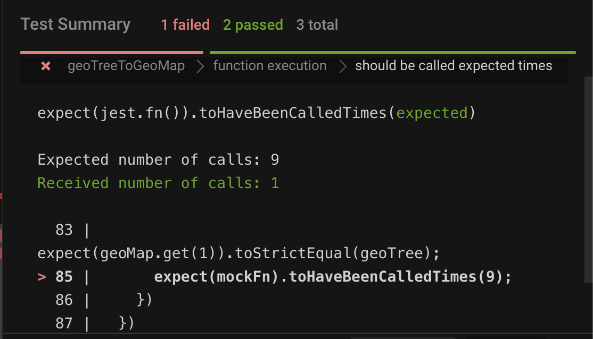

I'm starting to love Unit Testing, this old good practice adds so much value to any long-term product that I feel it should be mandatory in any software development team. I've realized that it increases your confidence as a software developer and helps your teammates to feel more comfortable when they review code because you are showing them what test cases you automated. And, I'm quite sure you will thank yourself in the future whenever you need or want to refactor some code.

In this post I will show you a functional approach approach for testing named exported recursive functions using Jest.

### Prerequisites

1. Have a good understanding about recursive functions, and how to code them.
2. Might come handy to read what <a href="https://v2.parceljs.org/" rel="noopener" target="_blank">Jest</a> does, how <a href="https://jestjs.io/docs/en/jest-object#jestspyonobject-methodname" rel="noopener" target="_blank">.spyOn</a> and <a href="https://jestjs.io/docs/en/jest-object#jestfnimplementation" rel="noopener" target="_blank">.fn</a> methods work.

### Let's Do It

I'm going to present you a real case scenario I faced weeks ago where a request to an API to fetch geographic locations returned a geographic tree. For the sake of simplicity, I'm going to describe a small portion of the response.

```json {numberLines:true}
{
  "id": "1",
  "name": "Belgium",
  "level": "3",
  "children": [
    {
      "id": "2",
      "name": "Brussels",
      "level": "2",
      "children": [
        {
          "id": "3",
          "name": "Ixelles/Elsene",
          "level": "1"
        },
        {
          "id": "4",
          "name": "Anderlecht",
          "level": "1"
        },
        {
          "id": "8",
          "name": "Jette",
          "level": "1"
        }
      ]
    },
    {
      "id": "5",
      "name": "Antwerpen",
      "level": "2",
      "children": [
        {
          "id": "6",
          "name": "Geel",
          "level": "1"
        },
        {
          "id": "7",
          "name": "Mechelen",
          "level": "1"
        },
        {
          "id": "9",
          "name": "Sint-Katelijne-Waver",
          "level": "1"
        }
      ]
    }
  ]
}
```

The response in this case is 3 levels depth. Although the example seems to be simple this could scale to deeper levels, and the data structure could become expensive to manipulate/query/handle if you want to get the very last and deepest level location.

Imagine for example,

1. you need to present this geographical tree as a list where each item has the location's `name` and its immediate parent's `name`.
2. you need to search a location by its name while the user types in an input, and show the matching results inside an autocomplete options list.
3. you need to build a breadcrumb if the user picks/selects a location. An array where the last element is what the user has selected and the first is the root location (in this case Belgium).

> What would be the first thing to do?

Well, from my perspective you will need a lookup table. It could be a `Map` or an `Object` where keys are the location ids and values are the locations as such.

I'm going to show you the solution I implemented.

**1st**, I described the API's request response using a Typescript interface:

```typescript {numberLines:true}
// Describes the API's response
export interface GeoTree {
  id: number
  name: string
  level: number
  children?: GeoTree[]
}
```

**2nd**, I implemented a recursive function that takes the geographical tree as 1st parameter and an instance of a `Map` (optional) as 2nd parameter.

```typescript {numberLines:true}
// Typescript types
export interface GeoMapElement<T extends GeoMapElement<T>> {
  id: number
  children?: T[]
  parentId?: number
}

export type GeoMap<T extends GeoMapElement<T>> = Map<number, GeoMapElement<T>>

export function geoTreeToGeoMap<T extends GeoMapElement<T>>(
  geoTreeNode: T,
  geoMap: GeoMap<T> = new Map<number, T>()
): GeoMap<T> {
  geoMap.set(geoTreeNode.id, geoTreeNode)

  if (geoTreeNode.children) {
    for (const child of geoTreeNode.children) {
      child.parentId = geoTreeNode.id
      geoTreeToGeoMap(child, geoMap)
    }
  }

  return geoMap
}
```

Quite simple solution, no? Now, in order test the `geoTreeToGeoMap` function I imported it into a `spec` file.

```typescript {numberLines:true}
describe("geoTreeToGeoMap", () => {
  it(`should not add "parentId to root location"`, () => {
    // geoTree is the object described in the beginning
    const geoMap = geoTreeToGeoMap(geoTree)

    expect(geoMap.get(1).parentId).toBeUndefined()
  })

  it(`should add "parentId to each location's child"`, () => {
    const geoMap = geoTreeToGeoMap(geoTree)

    expect(geoMap.get(2).parentId).toBe(1)
    expect(geoMap.get(3).parentId).toBe(2)

    expect(geoMap.get(5).parentId).toBe(1)
    expect(geoMap.get(6).parentId).toBe(5)
  })
})
```

No big deal, so far.

After testing the function's results I decided to make assertions on how many times the function was being called. I thought that using `jest.fn` to wrap the original implementation and use it afterwards was the way to do it.

```typescript {numberLines:true}
describe("geoTreeToGeoMap", () => {
  afterAll(() => {
    jest.clearAllMocks()
  })

  it("should be called expected times", () => {
    const mockFn = jest.fn(geoTreeToGeoMap)

    const geoMap = mockFn(geoTree)

    expect(geoMap.get(1)).toStrictEqual(geoTree)

    expect(mockFn).toHaveBeenCalledTimes(9)
  })
})
```

Unfortunately, the test could only track the first function's call.



The reason WHY is failing doesn't point to Jest but to how named exported functions are transpiled to Javascript.

```javascript {numberLines:true}
"use strict"

Object.defineProperty(exports, "__esModule", {
  value: true,
})
exports.geoTreeToGeoMap = geoTreeToGeoMap

function geoTreeToGeoMap(geoTreeNode, geoMap = new Map()) {
  geoMap.set(geoTreeNode.id, geoTreeNode)

  if (geoTreeNode.children) {
    for (const child of geoTreeNode.children) {
      child.parentId = geoTreeNode.id
      geoTreeToGeoMap(child, geoMap)
    }
  }

  return geoMap
}
```

After linking both parts, I understood that spying an exported function that calls itself directly doesn't reach the function used inside the function's body because it points to a different memory reference.

To solve this I could take one of the following solutions:

1. declaring an object, assign the function to one of its properties, and use the object's property reference inside the recursive function, or
2. importing the recursive function back into its own module and use the imported function inside itself.

Both solutions are well described in this <a href="https://stackoverflow.com/questions/45102677/testing-recursive-calls-in-jest" rel="noopener" target="_blank">Stack Overflow question #45102677</a>.

However, I find both solutions had caveats, here are my explanations.

1. The first solution doesn't play well in a front-end application because export default objects aren't tree shakable AFAIK.
2. The second solution produces to my taste a not pleasant code smell. It could be hard to understand WHY a module is importing into itself.

Now, here is my solution.

From a Functional Programming perspective the recursive function could be re-written to accept 3 parameters, being the 1st parameter the function used inside the function's body. Then, a Factory function could be created to bind to the 1st parameter the same recursive function which produces a new function.

The implementation using a Functional Programming approach is as follows:

`geoTreeToGeoMap.types.ts`

```typescript {numberLines:true}
export interface GeoMapElement<T extends GeoMapElement<T>> {
  id: number
  children?: T[]
  parentId?: number
}

export type GeoMap<T extends GeoMapElement<T>> = Map<number, GeoMapElement<T>>

export type GeoTreeToGeoMapRecursive<T extends GeoMapElement<T>> = (
  self: GeoTreeToGeoMapRecursive<T>,
  geoTreeNode: T,
  geoMap?: GeoMap<T>
) => GeoMap<T>

export type GeoTreeToGeoMap = <T extends GeoMapElement<T>>(
  geoTreeNode: T,
  geoMap?: GeoMap<T>
) => GeoMap<T & GeoMapElement<T>>
```

`geoTreeToGeoMap.ts`

```typescript {numberLines:true}
import {
  GeoMap,
  GeoMapElement,
  GeoTreeToGeoMapRecursive,
} from "./geoTreeToGeoMap.types"

export function geoTreeToGeoMapRecursive<T extends GeoMapElement<T>>(
  self: GeoTreeToGeoMapRecursive<T>,
  geoTreeNode: T,
  geoMap: GeoMap<T> = new Map<number, T>()
): GeoMap<T> {
  geoMap.set(geoTreeNode.id, geoTreeNode)

  if (geoTreeNode.children) {
    for (const child of geoTreeNode.children) {
      child.parentId = geoTreeNode.id
      self(self, child, geoMap)
    }
  }

  return geoMap
}

export const geoTreeToGeoMapFactory = <T extends GeoMapElement<T>>(
  recursiveFn: GeoTreeToGeoMapRecursive<T>
) => recursiveFn.bind(null, recursiveFn)

export const geoTreeToGeoMap: GeoTreeToGeoMap = geoTreeToGeoMapFactory(
  geoTreeToGeoMapRecursive
)
```

Then, in the `spec` file, the recursive function is wrapped with a jest mock using `jest.fn` and the Factory function uses the mock to produce the `geoTreeToGeoMap`.

```typescript {numberLines:true}
describe("function execution", () => {
  afterAll(() => {
    jest.clearAllMocks()
  })

  it("should be called expected times", () => {
    // Wrap the recursive implementation with a Spy to keep track of it recursive calls
    const geoTreeToGeoMapRecursiveSpy = jest.fn(geoTreeToGeoMapRecursive)
    const geoTreeToGeoMap: GeoTreeToGeoMap = geoTreeToGeoMapFactory(
      geoTreeToGeoMapRecursiveSpy
    )

    const geoMap = geoTreeToGeoMap(geoTree)

    expect(geoMap.get(1)).toStrictEqual(geoTree)

    expect(geoTreeToGeoMapRecursiveSpy).toHaveBeenCalledTimes(9)
  })
})
```

This way the function `geoTreeToGeoMapRecursiveSpy` can be used to make call's assertions, and the tests passed.

> I hope you liked it.
